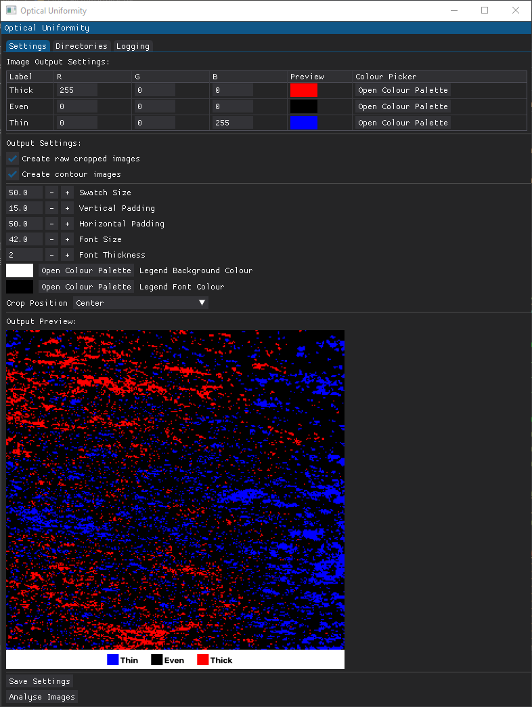

# 
<ins><strong>Optical Uniformity Analysis</strong></ins>

  

Optical Uniformity Analysis is a desktop application developed to automate the assessment of optical uniformity from large collections of microscopy images.

Created to support comparative analysis of coated and uncoated surfaces, the application processes batches of images, evaluates local intensity variations, and automatically generates visualisations and spreadsheet reports for each dataset. By automating repetitive image analysis tasks, the software significantly reduces processing time while ensuring consistent analysis across large image collections.

## <ins>Features</ins>

- Batch processing of multiple image datasets
- Automated image cropping with selectable crop locations
- Grid-based optical uniformity analysis
- Colour-coded thickness classification maps
- Customisable colour schemes and legends
- Live output preview before analysis
- Spreadsheet export of analysis results
- Automatic statistical summaries for each dataset
- Save and reload application settings
- Multi-threaded processing with integrated logging

## <ins>Application Overview</ins>

The application provides a configurable workflow for analysing large collections of optical images while producing consistent visualisations and statistical summaries.

### Batch Processing

Multiple image directories can be selected simultaneously, allowing entire experimental datasets to be analysed in a single operation.

Each dataset is processed independently, with analysis results automatically organised into dedicated output folders and Excel worksheets.

### Image Processing

Each image is converted to grayscale before a configurable crop region is extracted for analysis.

The cropped image is divided into a regular grid, where the average pixel intensity of each cell is calculated. These local intensity measurements are then compared with the overall image average to classify regions as:

- Thin
- Even
- Thick

The resulting classifications are rendered as colour-coded uniformity maps with automatically generated legends.

### Output Generation

For every processed dataset, the application can generate:

- Classified optical uniformity maps with configurable legends
- Cropped source images
- Excel spreadsheets containing statistical measurements
- Automatically calculated mean and standard deviation summaries
- Processing logs for traceability

## <ins>Technical Overview</ins>

The application is written in Python using DearPyGui for the graphical interface, OpenCV for image processing, NumPy for numerical analysis, Pandas for data handling and OpenPyXL for spreadsheet generation.

The software combines automated batch processing, configurable image preprocessing, statistical analysis and spreadsheet reporting into a single workflow. Live preview tools allow crop positions, colour schemes and legend formatting to be adjusted before processing begins, ensuring exported results match the desired presentation.

## <ins>Methodology</ins>

The analysis workflow consists of the following stages:

1. **Image Acquisition**  
   Images are loaded from one or more selected directories and converted to grayscale.

2. **Region Selection**  
   A configurable crop region is extracted from each image, allowing analysis to focus on a consistent area of interest.

3. **Grid-Based Sampling**  
   The cropped image is divided into a uniform grid, with the average pixel intensity calculated for every grid cell.

4. **Intensity Classification**  
   Each grid cell is classified as **Thin**, **Even** or **Thick** by comparing its average intensity with the overall image intensity using predefined thresholds.

5. **Visualisation**  
   A colour-coded uniformity map is generated together with a configurable legend for rapid visual interpretation.

6. **Statistical Reporting**  
   Key statistical measurements including mean pixel intensity, coefficient of variation, thickness distribution and uniformity metrics are exported to Excel for further analysis.

## <ins>Why This Project Exists</ins>

Assessing optical uniformity across large image datasets can be both repetitive and subjective when performed manually. Small variations in brightness are often difficult to compare consistently between images, particularly when analysing multiple experimental samples.

This application was developed to provide a repeatable and objective workflow that quantifies intensity variation while producing consistent visualisations and statistical summaries suitable for comparing large image datasets.

## <ins>Future Improvements</ins>

Potential future enhancements include:

- Support for user-defined classification thresholds.
- Interactive region-of-interest selection directly from the preview image.
- Additional statistical analysis and reporting options.
